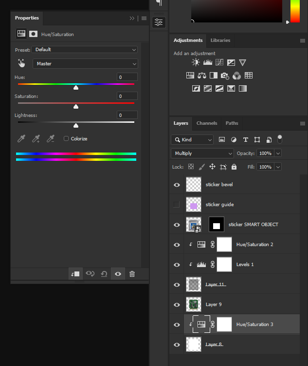
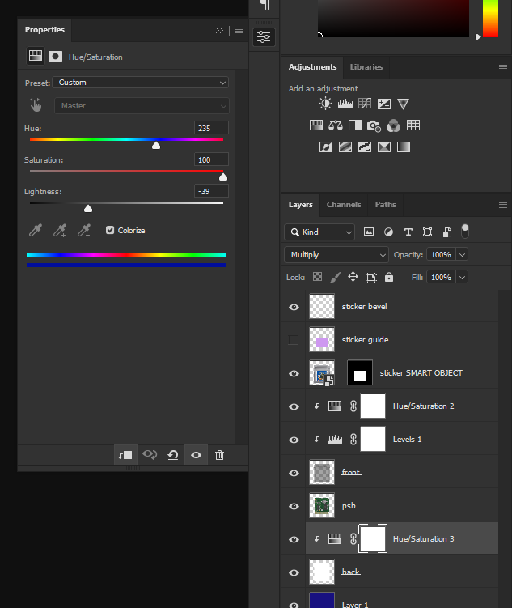
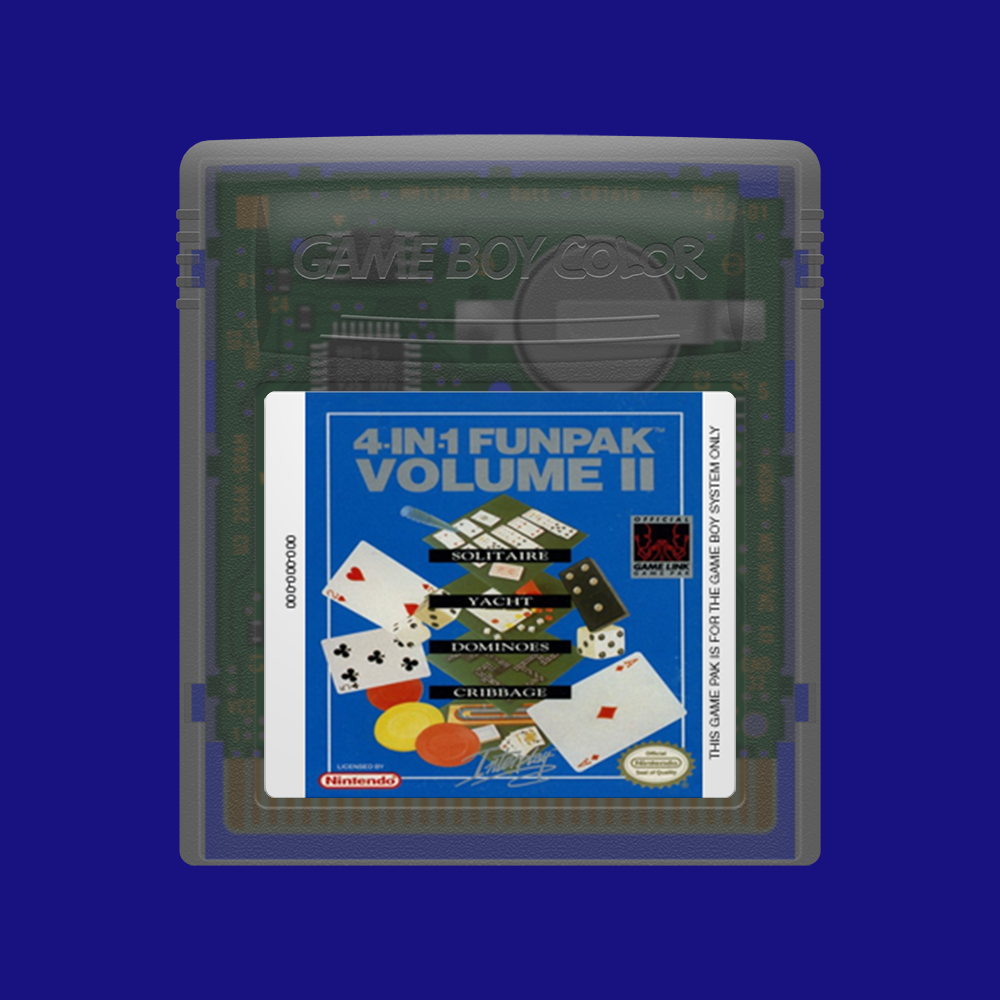

# Game Boy Color

This template is the same size and ration as the Game Boy template and the output can be used in the SGB templates as source, and uses (By default) the same EmuMovies collection as it's source.

The main thing that separates this template from the others is the three adjustment layers.

Two of them, a Hue & Saturation, and a Levels, are to help the front layer look as intended on backgrounds that are either lighter or darker than the 50% gray I developed the graphic over. Most of the time it should be acceptable but feel free to use them if you think it is needed.

The third, another Hue & saturation, is to produce fake transparency by adjusting the back layer to match a background color. The important thing to remember is that the background is mostly white and the adjustment layer is in multiply blending mode. This means that until you lower the Lightness (And check "Colorize") no other change will have any effect. (Because white is transparent in Multiply Blending mode, and the Back layer is unsaturated.)

(Default HSL settings.)

Settings used to produce the following image.)

To see this live please open the "GBC_Template_Fake_Transparency_Example.psd").

