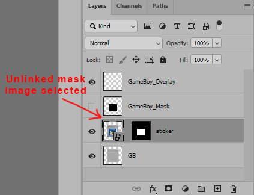

# Cartridges
These are vector based cartridge graphics that can be used in your front-end of choice.

They are intended as an artist resource, and are templates, rather than ready to use assets. My goal is to make it as easy as possible to create a set of cartridge images using any third party image set.

For the Game Boy template I chose the EmuMovies 2D cart package as source. It doesn't matter which one you choose, of the two available, but **they must be the same size and dpi that I used for my sample output.** (393x427 @ 120 dpi)(The collections are a little inconsistent as far as dpi and will require some conversion.)

To create a set of images I am using a PhotoShop script. (Replace Smart Object.jsx) It will need to be placed in "%Photoshop root%\Presets\Scripts".

After making sure all the source images have the same dpi, **copy the template into the same folder as your source images**, make sure the smart object is selected in the layers panel:

Select the script from the files menu:

a file browser dialog will open. Browse to your source images, select all of them and press "OK".

The script will replace the smart object contents with each image and save the output with the same filename. I recommend working with copies of your source just in case something goes wrong. (Usually an image size or dpi issue.)

This process will be the same for all my templates. You can use any source image you like, boxfront shots, screenshots, disk labels, custom lables, etc.

To get your custom image source to work, **make sure they are all the same size and dpi**. (Any size and dpi as long as they are all exactly the same.)

Load your template of choice and select the smart object layer. Some will have masks and some will be part of a masked group. Just select the smart object:

notice that when the smart object has a mask, the mask is not linked. You can also disable the mask by SHIFT+Left clicking the mask, and un-hide the layer directly above. The latter is set at 50% opacity to allow for easy positioning of source images.

right click the layer and select "Replace contents..." from the menu, and browse to a source image.

You can now freely resize the image, using the 50% layer as a guide. When you are satisfied, hide the guide layer, enable the mask, and save your file. **Copy your new template in the same folder as your source images**, and follow the above steps.

If you have any problems or have questions, please post in my LanchBox thread, 

[https://forums.launchbox-app.com/topic/60095-duimons-vector-cartridge-templates/](https://forums.launchbox-app.com/topic/60095-duimons-vector-cartridge-templates/)

I will answer ASAP.:smile: