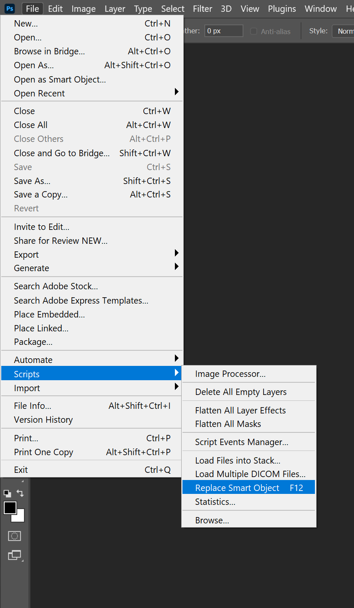
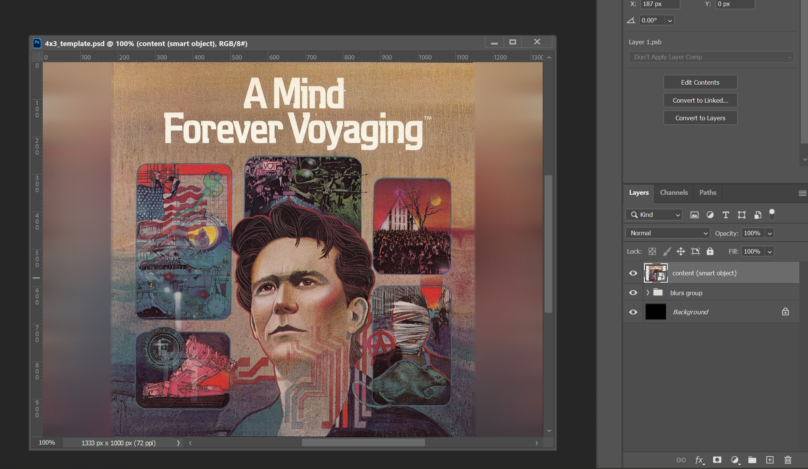
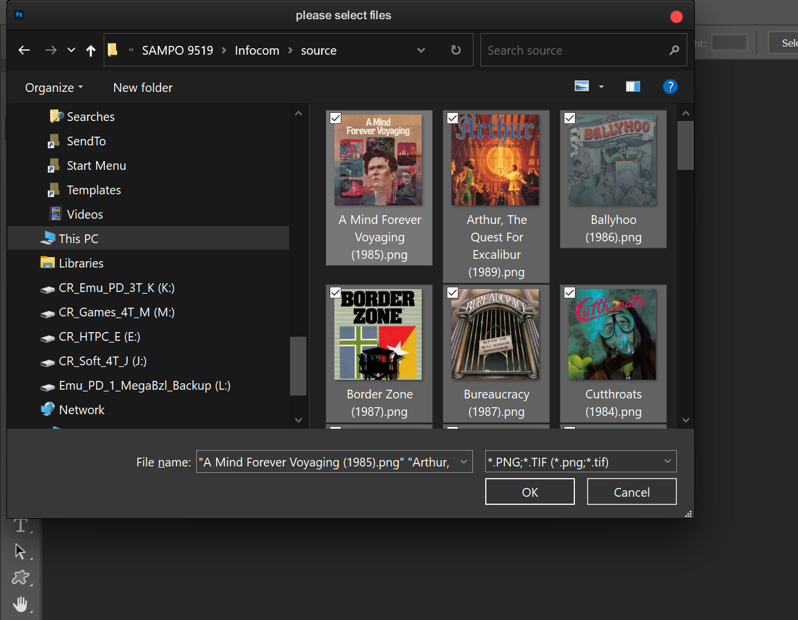
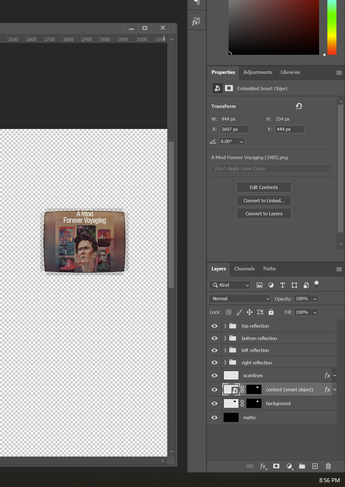

### Sampo 9519 Art Templates
___

This guide will show how to use a Photoshop script and templates, to create art for the Sampo 9519 small screens.

I have included art with my graphics for all the Infocom Z-Machine games. This guide is mainly for NDS and 3DS art for my Vintage TV presets.

Since these presets use two of the three screens, we will be focusing on the remaining top screen.
___

First you need to download the "Assets.7z" file in this folder and unpack it. You will see two folders. "Photoshop_Script" contains the script, and "Templates" contains the templates. The script needs to be placed in "%Photoshop root%\Presets\Scripts".

Once the script is installed it can be accessed in the "File" menu in Photoshop.



I normally map the script to the f12 key. (Since I use it often.)

___
Next you need to collect and prepare your source. For these templates the source needs to be 1000 pixels in height and 72dpi. If the source has a wider aspect than 4x3 it will be cropped during the process. I tested the 2D NDS and 2.5D 3DS boxes available on EmuMovies, so I highly recommend them.

My presets use the ```$GAME$``` wildcard available in Retroarch so you need to verify that your images share the names of your ROMs. (EmuMovies uses the No-Intro naming convention.)

Once you have your source, use an image utility of your choice to resize them and adjust the dpi if needed. (I use XnConvert among others. [http://www.xnconvert.com](http://www.xnconvert.com))

Make sure the height is 1000px, the template will produce unpredictable results using images with a different height and/or dpi.

** Note ** (For those wanting to use the script in their own templates.) The script can use images of any size or dpi. The restrictions come into play once you create a template. 

___

Let's open the first template "4x3_template.psd". This template converts your art to a 4x3 aspect. It does this by changing the canvas size and applying various blurs to fill the extra space. (As you can see, I used Infocom Z-Machine art when I created the template. :-))



By default the file opens with the "content (smart object)" layer selected. The script will fail with an error if a smart object is not selected.


If we expand the "blurs group" you can see the blurs I used, and modify them or use them as inspiration.

Select the "content (smart object)" layer again and execute the script in "MENU >>> File >>> Scripts >>> Replace Smart Object".

A file browser window will open where you can navigate to your source.

#### ** Important ** Your source will be permanently modified. Make sure to back it up first!



Select all your images (Select one and press Ctrl+A) then click the "OK" button.

The script will process all the images one by one, replacing the contents of the smart object with the source image and saving to a file with the original name. Be patient, it can take a long time if you have many images.

___

I have include templates for both the top and bottom small screens. We will only be using the top art templates. I have included templates that yield both color and black & white output. (Depending on which of my presets you will be using.)

If you are happy with the results of the first template, let's open the "top_art.psd."



This template uses one smart object for the main content, then uses four separate instances of the object for the reflections. This means that when you replace the contents of the main smart object, the reflections also update.

Notice that the template once again opens with the content layer selected. Photoshop saves layer selection attributes when it saves a PSD. If you have modified the file, or created your own template without selecting the smart object before saving, make sure to select it before running the script.

After creating a backup of your new 4x3 images, use the script to create art for the top small screen.

___

You should now have top screen art for all your ROMs.

Move/copy them to the appropriate folder.

**NDS**

"\Duimon-Vintage-TV\Graphics\9519\NDS\b+w"

or

"\Duimon-Vintage-TV\Graphics\9519\NDS\color"

**3DS**

"\Duimon-Vintage-TV\Graphics\9519\3DS\b+w"

or

"\Duimon-Vintage-TV\Graphics\9519\3DS\color"

If your images aren't named correctly, or you are missing images, a default logo graphics will be used.

___

Now that you have a little experience, I hope you find a way to use this script in other projects. It is a great time saver, and can be very powerful.

Feel free to use the Infocom Z-Machine for other systems if you like. You can use the above methods for creating art for any system.

Keep in mind that there is no easy way to process two smart object simultaneously, so I recommend using a static logo for one screen.

This restriction, and this entire method, may only be temporary. Hyperspace Madness is exploring the possibilities of displaying art on second and/or third screens.

Even then, Potato presets will probably need some TLC. ;-)


